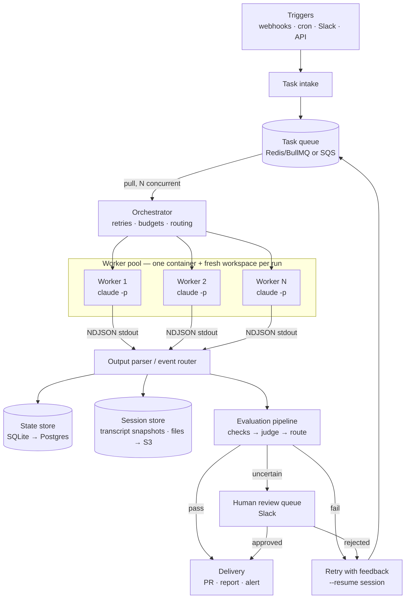
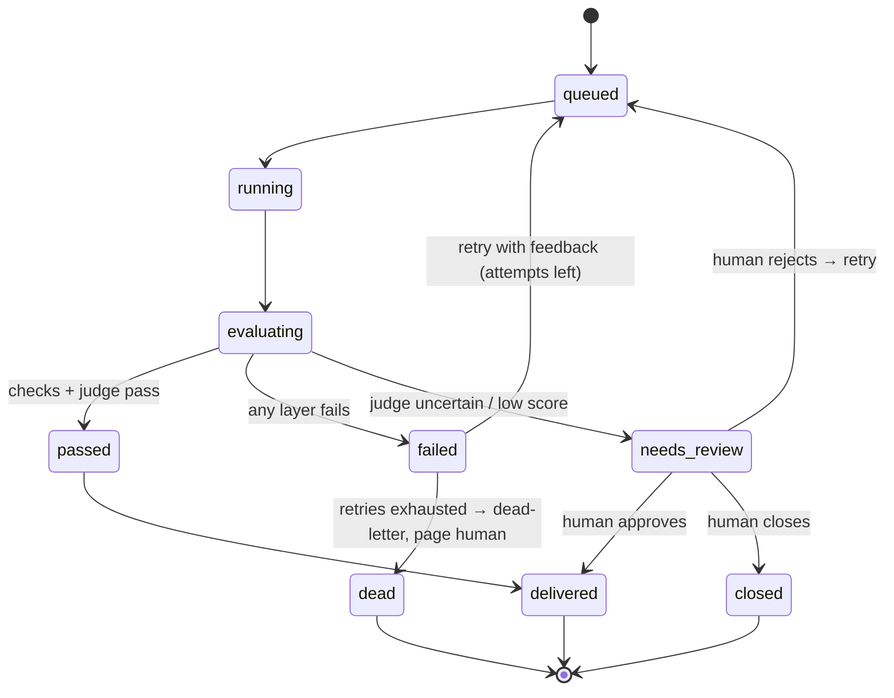
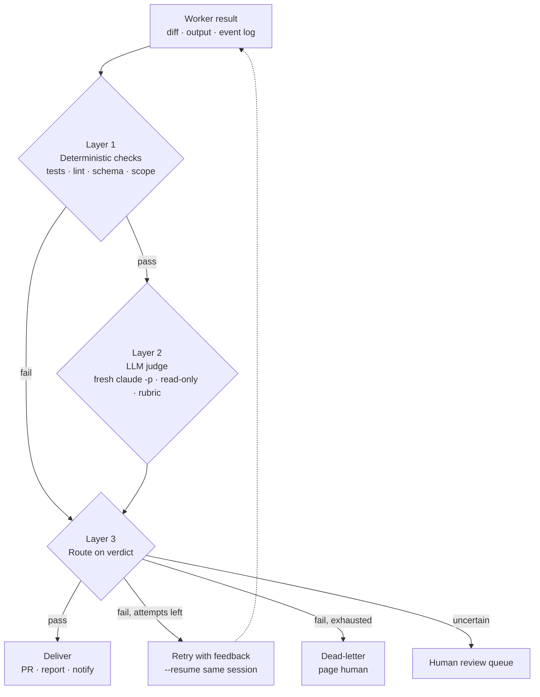

# Agent Harness on Claude Code Headless (`claude -p`)
## System Design Document

**Status:** Draft v1.1 · **Owner:** Platform team · **Last updated:** 2026-09-13

> v1.1 applies the CLI corrections from [IMPLEMENTATION_PLAN.md §0](IMPLEMENTATION_PLAN.md) (verified against
> Claude Code CLI 2.1.243; evidence in [docs/cli-contract.md](docs/cli-contract.md), fixtures in
> [testdata/events/](testdata/events/)). Implementation language is Go; the Node snippets in §4.3 are
> reference pseudocode only.

---

## 1. Overview

This document specifies a production harness that runs autonomous agent tasks by spawning
Claude Code in headless mode (`claude -p`) as isolated worker subprocesses. The harness
provides everything the CLI does not: durable queueing, session persistence, sandboxing,
budget enforcement, multi-layer result evaluation, retry-with-feedback loops, and a
human review gate.

**Design thesis:** `claude -p` is a stateless, composable unit of agent work with tool use,
file editing, bash, MCP, and permission controls already built in. We do not build an agent
loop. We build deterministic plumbing around one.

### 1.1 Goals

- Run agent tasks unattended from webhooks, cron, and queues with no interactive UI.
- Guarantee every run is bounded (turns, wall clock, cost) and isolated (workspace, credentials, tools).
- Evaluate every result before delivery; never ship unverified output to a production surface.
- Support multi-turn workflows (plan → approve → implement) via session resumption.
- Produce a complete, replayable audit trail for every run.
- Keep the orchestrator dumb: all task intelligence lives in prompts, task specs, and CLAUDE.md.

### 1.2 Non-goals

- Building a custom agent loop or tool-execution engine (Claude Code provides this).
- Real-time bidirectional chat with a running worker (v1; see §13 SDK migration path).
- Fully autonomous merge-to-main. Humans and CI remain the final gate for code changes.
- Multi-tenant public SaaS concerns (auth/billing for external users) — this is an internal platform.

---

## 2. Architecture



### 2.1 Component inventory

| Component | Responsibility | Suggested tech |
|---|---|---|
| Task intake | Normalize triggers into task records | HTTP endpoints, cron |
| Task queue | Durable buffering, priority, dead-letter | BullMQ (Redis) or SQS |
| Orchestrator | Concurrency, retries, budgets, routing | Go service (single `harness` binary) |
| Workspace manager | Provision/destroy isolated workspaces | Docker + git clone, or Firecracker |
| Worker runner | Spawn and supervise `claude -p` | `os/exec`, own process group |
| Output parser | NDJSON event routing, progress, audit | Streaming line reader |
| Session/state store | Runs, costs, artifacts index; session transcript snapshots (§4.4) | SQLite → Postgres; local files → S3 |
| Evaluation pipeline | Checks → judge → verdict routing | Scripts + judge `claude -p` |
| Delivery adapters | PRs, reports, Slack, S3 artifacts | GitHub API, Slack API |
| Review queue | Human approve/reject → resume | Slack interactive messages |
| Observability | Logs, metrics, traces, cost dashboards | OTel + Grafana/Datadog |

---

## 3. Task model

Every unit of work is a **task record**. Tasks are immutable; each execution attempt is a **run**.

### 3.1 Task schema

```jsonc
{
  "task_id": "tsk_01J8...",
  "kind": "code_fix | code_review | report | triage | custom",
  "prompt": "…rendered from a template + trigger payload…",
  "workspace": {
    "type": "git",
    "repo": "org/service-a",
    "ref": "main",
    "write_access": false        // worker gets a fork/branch token only
  },
  "policy": {                    // per-kind defaults, overridable per task
    "allowed_tools": ["Read", "Edit", "Bash(git *)", "Bash(npm test)"],
    "max_turns": 30,
    "timeout_ms": 900000,
    "max_cost_usd": 2.50,
    "max_retries": 2,
    "judge": { "enabled": true, "samples": 1, "threshold": 7 }
  },
  "acceptance": {                // the task's definition of done — machine-checkable
    "commands": ["npm test", "npm run lint"],
    "json_schema": null,         // set for structured-output tasks
    "diff_scope": ["src/**"],    // files the worker may touch
    "custom_checks": []
  },
  "priority": 5,
  "requested_by": "webhook:github:pr-4812",
  "created_at": "2026-09-13T04:12:00Z"
}
```

### 3.2 Run schema

```jsonc
{
  "run_id": "run_01J8...",
  "task_id": "tsk_01J8...",
  "attempt": 1,
  "session_id": "6f049bbf-9a65-44ed-9196-a589b89878fb", // UUIDv4 minted by the harness, passed as --session-id
  "session_mode": "new | continue | fork | ephemeral",   // see §4.4
  "session_uri": "s3://harness-sessions/tsk_01J8/6f049bbf-….jsonl", // transcript snapshot, restored before --resume
  "status": "queued | running | evaluating | passed | failed | needs_review | dead | delivered | closed",
  "worker": { "container_id": "…", "workspace_path": "…" },
  "metrics": { "turns": 14, "duration_ms": 412000, "cost_usd": 0.83 },
  "eval": {
    "checks": { "tests": "pass", "lint": "pass", "schema": "n/a",
                "exit_code": 0, "permission_denials": [], "diff_scope": "pass" },
    "judge": { "verdict": "pass", "scores": { "task_completion": 9, "minimal_diff": 8,
               "no_scope_creep": 9, "code_quality": 8 }, "reasoning": "…" }
  },
  "event_log_uri": "s3://harness-audit/run_01J8.ndjson",
  "artifacts": ["pr:org/service-a#4813"],
  "started_at": "…", "finished_at": "…"
}
```

**Run state machine:**



---

## 4. Worker design

### 4.1 Isolation model

- One task run = one container (or throwaway VM) = one fresh git clone/workspace.
- Least-privilege credentials injected per run: read-only repo token unless the task kind
  requires writes; writes go to a bot branch, never a protected branch.
- Network egress restricted to an allowlist (package registries, required APIs).
- Workspace destroyed after artifacts are captured. Nothing persists in the worker: the only
  cross-run state is the session transcript, which the runner snapshots out to the session
  store at exit and restores into a fresh worker before `--resume` (§4.4).

### 4.2 Invocation contract

```bash
# Illustrative only. The runner builds an argv slice and passes the prompt as one argument
# (or on stdin); no shell ever sees user-controlled text.
# env: PATH  CLAUDE_CONFIG_DIR=/run/claude-config  ANTHROPIC_API_KEY=…  (nothing else inherited)
claude -p <prompt> \
  --output-format stream-json \
  --verbose \
  --include-partial-messages \
  --allowedTools "Read,Edit,Bash(git *),Bash(npm test)" \
  --max-turns 30 \
  --max-budget-usd 2.25 \                  # budget_flag_ratio (0.9) × policy max_cost_usd 2.50
  --permission-mode dontAsk \
  --setting-sources project --strict-mcp-config \
  --session-id <new-uuid>                   # new session …
  # --resume <session-id>                   # … or continue an existing one (never both, see §4.4)
```

Flags that do **not** exist in CLI 2.1.243 and must not appear anywhere: `--permission-prompts`.
There is no `system/permission_denied` event; denials are only reported on `result.permission_denials`.

Contract rules:

1. **`--output-format stream-json`** always. The harness consumes NDJSON events; the final
   `result` event carries `session_id`, cost metadata, and `permission_denials`. Classify on
   `is_error` + `terminal_reason`, never on `subtype` alone (an auth failure reports
   `subtype: "success"` with `is_error: true`).
2. **`--permission-mode dontAsk`** for unattended runs. Non-allowlisted tools are denied
   silently and listed in `result.permission_denials`. The evaluator treats a run with
   denials on task-critical tools as incomplete.
3. **`--allowedTools`** is the primary blast-radius control. Prefer scoped patterns
   (`Bash(git *)`, `Bash(npm test)`) over blanket `Bash`.
4. **`--max-turns`** + **`--max-budget-usd`** + orchestrator wall-clock timeout (SIGTERM, then
   SIGKILL, sent to the worker's process group) bound every run. The CLI checks the budget
   after the turn that crosses it, so set the flag slightly below the policy ceiling.
5. **`--json-schema`** for any task whose deliverable is structured data; the harness reads
   `structured_output` from the JSON result and validates it independently.
6. **`--session-id <uuid>`** on every new session (harness-minted) and **`--resume <uuid>`**
   for retries-with-feedback and multi-phase workflows, so the worker keeps its context
   instead of restarting cold. Session rules are in §4.4.
7. `CLAUDE.md` in the workspace root carries per-repo conventions (test commands, style,
   forbidden paths). Task templates stay generic; repo knowledge lives with the repo.
8. **`CLAUDE_CONFIG_DIR`** points at an empty per-run directory and **`--setting-sources project
   --strict-mcp-config`** stops the worker inheriting the host user's settings, MCP servers,
   hooks and plugins. Never override `HOME` (it relocates nothing the CLI needs and breaks
   git/ssh config). Workers authenticate with `ANTHROPIC_API_KEY` only; the host's Keychain
   login is not visible from an isolated config dir. **Open:** `--bare` (strict API-key auth,
   no hooks/plugins/keychain) plus `--add-dir <workspace>` may be the stronger choice if it still
   loads the workspace `CLAUDE.md`; blocked on an API key to test (plan Step 4.3).
9. **Cost signal.** `assistant` events carry `message.usage` (token counts) but no cost; the only
   authoritative cost is `result.total_cost_usd`, which arrives at exit. `--max-budget-usd` is
   therefore the first line of defence. The orchestrator's mid-run kill is a backstop that
   estimates spend from token usage × a pinned per-model price table (or a raw output-token
   ceiling), never from a running `total_cost_usd`, which does not exist mid-stream.

### 4.3 Runner (reference implementation, Node)

```javascript
import { spawn } from "node:child_process";
import readline from "node:readline";

export async function runWorker(task, run) {
  const args = [
    "-p", task.prompt,
    "--output-format", "stream-json", "--verbose", "--include-partial-messages",
    "--allowedTools", task.policy.allowed_tools.join(","),
    "--max-turns", String(task.policy.max_turns),
    "--max-budget-usd", String(task.policy.max_cost_usd * 0.9),
    "--permission-mode", "dontAsk",
    "--setting-sources", "project", "--strict-mcp-config",
    ...sessionArgs(run),   // new: --session-id <id> | continue: --resume <id>
                           // fork: --resume <parent> --fork-session --session-id <id>
                           // ephemeral: --session-id <id> --no-session-persistence
  ];

  await sessions.restore(task.task_id, run, configDir);          // no-op for session_mode "new"
  const proc = spawn("claude", args, {
    cwd: run.worker.workspace_path,
    detached: true,                                                // own process group
    env: { PATH: baseEnv.PATH, CLAUDE_CONFIG_DIR: configDir,
           ANTHROPIC_API_KEY: await creds.workerKey(task) },
  });

  const killGroup = (sig) => process.kill(-proc.pid, sig);       // whole group: tool children too
  const term = setTimeout(() => {
    killGroup("SIGTERM");
    setTimeout(() => killGroup("SIGKILL"), GRACE_MS);              // escalate after grace period
  }, task.policy.timeout_ms);
  const rl = readline.createInterface({ input: proc.stdout });
  let result = null, estCostUsd = 0;

  for await (const line of rl) {
    let evt; try { evt = JSON.parse(line); } catch { await auditLog.appendRaw(run.run_id, line); continue; }
    await auditLog.append(run.run_id, evt);                       // full replayable trail
    if (evt.type === "assistant") {                               // tokens only, no cost field
      estCostUsd += priceTable.estimate(evt.message.model, evt.message.usage);
      if (estCostUsd > task.policy.max_cost_usd) killGroup("SIGTERM");   // backstop behind --max-budget-usd
    }
    if (evt.type === "result") result = evt;                      // authoritative cost + denials
    progress.emit(run.run_id, evt);                               // live UI / Slack thread
  }

  clearTimeout(term);
  const exit = await onceExit(proc);
  await sessions.snapshot(task.task_id, run, configDir);         // always, even after a crash
  const stderr = await drain(proc.stderr);
  // result === null → crash or CLI usage/session error (empty stdout, one stderr line).
  // "No conversation found with session ID" in stderr → session lost → cold retry (§4.4).
  return { result, exit, stderr, estCostUsd };
}
```

### 4.4 Session management

A `claude -p` session is one JSONL transcript the CLI writes to
`$CLAUDE_CONFIG_DIR/projects/<cwd-slug>/<session_id>.jsonl`. The CLI owns the file format;
the harness owns the **id**, the file's **location**, and its **lifetime**. Everything below
was verified against CLI 2.1.243 (see `docs/cli-contract.md`).

**Ids.** The harness mints a UUIDv4 per session and passes it with `--session-id`. It is
stored on the run (`run.session_id`) and, for resumable tasks, as the task's resume pointer
(`task.session_id`) before the process is spawned, so a crash before the `result` event
still leaves a known id. Ids are never reused: the CLI refuses a `--session-id` whose
transcript already exists, so a cold retry mints a fresh one.

**Modes** (`run.session_mode`):

| Mode | Flags | Used by |
|---|---|---|
| `new` | `--session-id <new>` | First attempt of any task; fan-out children that need no parent context; synthesizer |
| `continue` | `--resume <task.session_id>` (no `--session-id`) | Retry with feedback (§5.3), phase 2 after human approval (§6), retry after timeout or crash |
| `fork` | `--resume <parent> --fork-session --session-id <new>` | Fan-out children that should inherit the planner's context |
| `ephemeral` | `--session-id <new> --no-session-persistence` | LLM judge (§5.2); leaves no transcript |

`--session-id` and `--resume` are mutually exclusive unless `--fork-session` is present.

**Storage.** Every worker starts with an empty `CLAUDE_CONFIG_DIR`. For `continue` and
`fork` runs the runner first restores `<session_id>.jsonl` from the session store into
`projects/<slug>/`; after every run exit, including timeout and crash, it snapshots the
transcript back. Resume looks the session up by id across all `projects/*/` folders, so the
workspace path may differ between attempts and the file may be restored under any slug.
Local implementation: `<data_root>/sessions/<task_id>/<session_id>.jsonl`. Production:
object storage under the same key. The volume-mount alternative is not needed.

**Recovery.** Timeout (SIGTERM → SIGKILL) and crashes leave a resumable transcript, and
resuming after either keeps the same id and the interrupted context. The harness therefore
retries **from the same session** in both cases. Only when the transcript cannot be
restored, or the CLI answers `No conversation found with session ID`, does it fall back to
a cold retry with a new id (this is the corrected §9 rule).

**Lifetime.** A task's live session files exist while the task is non-terminal. On
`delivered`, `closed` or `dead` the final snapshot is kept as an audit artifact for
`retention.sessions_days` and the live directory is deleted. Judge runs leave nothing.
The transcript doubles as a replayable trail: an operator can `claude --resume <id>` from
a restored copy to inspect a failed run interactively.

---

## 5. Evaluation pipeline

Evaluation runs in the worker's workspace *after* the process exits, before anything is delivered.
Three layers, cheapest first. Each layer can short-circuit to `fail`.



### 5.1 Layer 1 — Deterministic checks (zero-AI, always run)

| Check | Signal | Fail condition |
|---|---|---|
| Exit code | Process health | non-zero, **and** `result.is_error` / `terminal_reason != completed` (budget breach and auth failure exit 1 with a `result`; a missing `result` is a crash) |
| Turn exhaustion | `result.num_turns == max_turns` (counted per invocation; a resumed run counts only its own turns) | usually stuck → fail |
| Permission denials | `result.permission_denials` | denial on a task-critical tool |
| Acceptance commands | `npm test`, `lint`, build | any non-zero |
| Diff scope | `git diff --name-only` vs `acceptance.diff_scope` | out-of-scope file touched |
| Diff sanity | `git diff --stat` | empty diff on a change task; deleted tests |
| Schema validation | `structured_output` vs `acceptance.json_schema` | invalid; `n/a` when the task has no `json_schema` (plain runs put text in `result.result` and emit no `structured_output`) |

Expected to catch 70–80% of bad results at zero marginal cost.

### 5.2 Layer 2 — LLM judge (separate `claude -p`, fresh context)

- Judge sees: task spec, diff, test output, deterministic-check summary.
  Judge never sees the worker's chain of reasoning (prevents sycophantic agreement).
- Judge is read-only: `--allowedTools "Read"` — it may inspect the workspace, never edit it.
- Rubric-scored structured output enforced with `--json-schema`:

```bash
# Illustrative. The harness renders the prompt (task spec + `git diff <base>` + acceptance
# outputs + check summary) to a string and passes it as one argv element — no shell expansion.
# Same env isolation as a worker: PATH, empty CLAUDE_CONFIG_DIR, ANTHROPIC_API_KEY.
claude -p <judge-prompt> \
  --output-format json --allowedTools "Read" --permission-mode dontAsk \
  --max-turns 5 --max-budget-usd 0.25 [--model <judge.model>] \
  --setting-sources project --strict-mcp-config \
  --session-id <new-uuid> --no-session-persistence \      # ephemeral mode (§4.4): no transcript
  --json-schema '{"type":"object","properties":{
      "task_completion":{"type":"integer"},"minimal_diff":{"type":"integer"},
      "no_scope_creep":{"type":"integer"},"code_quality":{"type":"integer"},
      "gamed_checks":{"type":"boolean"},
      "verdict":{"enum":["pass","fail","uncertain"]},
      "reasoning":{"type":"string"}},
    "required":["verdict","reasoning","gamed_checks"]}'
```

The verdict is `structured_output` on the single JSON result; the harness re-validates it against
the rubric schema. A judge that times out, breaches its budget, or returns invalid JSON yields
`uncertain`, never `pass`.

- High-stakes task kinds set `judge.samples = 3` → majority verdict (single-sample judges are noisy).
- `gamed_checks: true` is an automatic fail regardless of scores.

### 5.3 Layer 3 — Routing

```javascript
function route(task, run, checks, judge) {
  if (checks.failed || judge.verdict === "fail" || judge.gamed_checks) {
    if (run.attempt < task.policy.max_retries) {
      return retryWithFeedback(task, run, feedbackText(checks, judge)); // --resume same session
    }
    return deadLetter(task, run);
  }
  if (judge.verdict === "uncertain" || minScore(judge) < task.policy.judge.threshold) {
    return humanReviewQueue(task, run);   // Slack: diff + judge reasoning + approve/reject
  }
  return deliver(task, run);
}
```

The retry prompt is the failure evidence, verbatim: check logs + judge reasoning + "fix these
issues", resumed into the **same session** so the worker repairs instead of restarting.

### 5.4 Layer 4 — Offline evals (evaluating the harness itself)

- **Golden task set:** 20–50 tasks with known-good outcomes, stored in-repo
  (`/evals/golden/*.json`). Re-run on every change to prompts, task templates, CLAUDE.md,
  tool policies, or model version.
- **Tracked metrics per suite run:** pass rate, retry rate, avg turns, avg cost, avg
  duration, judge/human agreement rate.
- **Feedback loop:** every human override in the review queue (approve-despite-fail or
  reject-despite-pass) is logged and periodically converted into new golden cases and
  rubric adjustments.
- Regression gate: golden-suite pass rate may not drop more than a configured delta on
  any config change; otherwise the change is blocked.

---

## 6. Multi-phase workflows (human-in-the-loop)

Pattern: **plan → approve → implement → evaluate → deliver.**

1. Run 1 (`session_mode: new`): worker produces a plan (`--json-schema` plan format), stops.
   The harness already holds `session_id` (it minted it) and snapshots the transcript.
2. Review queue posts the plan to Slack with Approve / Edit / Reject.
3. On approve: orchestrator enqueues run 2 (`session_mode: continue`) with `--resume <session_id>`
   and prompt "Plan approved — implement step by step." The transcript is restored into the
   new worker first (§4.4).
4. Implementation result flows through the standard evaluation pipeline.

The same mechanism powers fan-out patterns: a planner session decomposes work into subtasks;
the orchestrator runs N parallel workers, one per subtask, either as fresh sessions or as
`fork` sessions of the planner (`--resume <planner> --fork-session --session-id <child>`)
when the children need the planner's reasoning; a synthesizer session (fresh `claude -p`)
merges results. The orchestrator only moves data — no LLM calls
in orchestration code.

---

## 7. Security

- **Credentials:** short-lived, per-run, least-privilege. Worker API key is a scoped key
  with a spend limit where supported. Repo tokens are branch-scoped bot tokens.
- **Tool policy:** allowlist-only via `--allowedTools`; deny-by-default. No blanket `Bash`
  in any default policy. Judges are read-only.
- **Prompt-injection posture:** worker inputs (PR bodies, issue text, web content) are
  untrusted. Mitigations: diff-scope enforcement, no write credentials to protected
  surfaces, evaluation gate before delivery, judge instructed to flag out-of-scope actions.
  Anything the worker "decides" to do outside the task spec fails `no_scope_creep`.
- **Egress control:** container network allowlist; secrets never mounted into workspaces
  the diff can capture.
- **Audit:** the full NDJSON event stream per run is retained (S3, WORM/retention policy) —
  every tool call, every file touched, replayable.

---

## 8. Observability & cost control

- **Metrics:** runs by status, queue depth/age, p50/p95 duration, turns, cost per run,
  cost per task kind per day, permission-denial rate, retry rate, judge-disagreement rate.
- **Budgets:** per-run ceiling (`--max-budget-usd` at `budget_flag_ratio` × `policy.max_cost_usd`,
  orchestrator token-estimate kill as backstop), per-kind daily ceiling (stop enqueueing),
  global daily ceiling (circuit breaker + page).
- **Tracing:** one trace per run: intake → queue → worker → checks → judge → route → deliver.
- **Live progress:** parsed stream events power a per-run timeline (Slack thread or web UI):
  tool calls, files edited, tests run, cost ticking up.
- **Alerting:** dead-letter arrivals, budget breaches, golden-suite regressions,
  permission-denial spikes (usually a policy misconfiguration).

---

## 9. Failure modes & recovery

| Failure | Detection | Recovery |
|---|---|---|
| Worker hangs | Wall-clock timeout | SIGTERM → SIGKILL to the process group; snapshot transcript; retry from same session |
| Worker crashes mid-run | Exit code, no `result` event | Snapshot transcript; retry from same session (verified resumable after SIGKILL) |
| Session transcript missing or corrupt | Restore fails, or CLI stderr `No conversation found with session ID` | Cold retry with a freshly minted id; log the lost session |
| Auth or API failure before first turn | `is_error` + `terminal_reason: api_error`, cost 0 | Not a task failure: do not consume an attempt; back off and requeue; page if persistent |
| Runaway loop | CLI stops itself: `terminal_reason: budget_exhausted` (`subtype: error_max_budget_usd`, `result: null`) or `max_turns` reached; orchestrator wall-clock / token-estimate kill as backstop | Fail run; judge feedback on retry from the same session |
| Bad output shape | Schema validation | Auto-fail → retry with schema error as feedback |
| Tests gamed | Judge `gamed_checks` | Auto-fail; flag task kind for rubric review |
| Rate limiting | `rate_limit_event` in the stream; 429 stderr/result shape still unverified (cli-contract §4) | Exponential backoff; global concurrency shed |
| Queue outage | Health checks | Intake buffers to disk; orchestrator idles |
| Model/CLI regression | Golden-suite gate | Pin CLI + model version; roll back config |

**Idempotency:** delivery adapters are idempotent (PR upsert keyed by branch `harness/<task_id>`; report
writes keyed by `run_id`) so retried deliveries never duplicate.

---

## 10. Deployment topology

- **MVP (single node):** orchestrator + Redis + Postgres + Docker workers on one VM.
  Adequate to ~10 concurrent workers.
- **Scaled:** stateless orchestrator replicas; workers as Kubernetes Jobs (one Job per run)
  with a dedicated node pool; Postgres managed; queue = SQS/managed Redis; artifacts +
  audit logs in S3.
- **Pinning:** the Claude Code CLI version and model are pinned in the worker image and
  only bumped behind a golden-suite pass.

---

## 11. Configuration surface

```yaml
# harness.yaml
concurrency:
  global: 12
  per_kind: { code_fix: 6, report: 4, triage: 4 }
budgets:
  per_run_usd_default: 2.50
  daily_usd: { code_fix: 60, report: 25, triage: 15, global: 120 }
worker:
  image: harness/worker:cli-<pinned>
  default_timeout_ms: 900000
  default_max_turns: 30
  budget_flag_ratio: 0.9           # --max-budget-usd = ratio × policy ceiling (CLI checks after the turn)
session:
  store: local | s3                # snapshot/restore of <session_id>.jsonl, see §4.4
  root: /var/lib/harness/sessions  # local: <root>/<task_id>/; s3: bucket/prefix
judge:
  model_flag_passthrough: []       # judge uses default; override per kind if needed
  default_threshold: 7
review:
  slack_channel: "#agent-review"
  sla_hours: 24                    # unanswered reviews escalate
retention:
  audit_ndjson_days: 365
  sessions_days: 30                # final transcript snapshot kept after task is terminal
  workspaces: destroy_on_capture
```

Task-kind templates (`/templates/<kind>/prompt.md.tmpl` + `policy.json` + `acceptance.json`)
are versioned in-repo and covered by the golden suite.

---

## 12. Milestones

1. **M1 — Walking skeleton:** intake API → queue → single worker → stream-json parse →
   deterministic checks → PR delivery. SQLite. One task kind (code_fix).
2. **M2 — Evaluation:** LLM judge, routing, retry-with-feedback via `--resume`, review queue.
3. **M3 — Ops hardening:** containers, budgets, dashboards, dead-letter paging, audit to S3.
4. **M4 — Golden suite + regression gate;** second and third task kinds.
5. **M5 — Fan-out workflows** (planner → parallel workers → synthesizer); scaled topology.

---

## 13. Future: Agent SDK migration path

The spawn-per-task CLI model is simple, restartable, and easy to reason about. Migrate a
component to the **Claude Agent SDK** only when it needs what the CLI does poorly:
typed message objects, streaming callbacks, bidirectional mid-run input, or programmatic
permission handling. The task/run schemas, evaluation pipeline, and routing logic are
transport-agnostic and carry over unchanged — only the worker runner is swapped.

---

## Appendix A — References

- Headless mode: https://code.claude.com/docs/en/headless
- Claude Code overview: https://docs.claude.com/en/docs/claude-code/overview
- CLI reference: https://code.claude.com/docs/en/cli-reference
